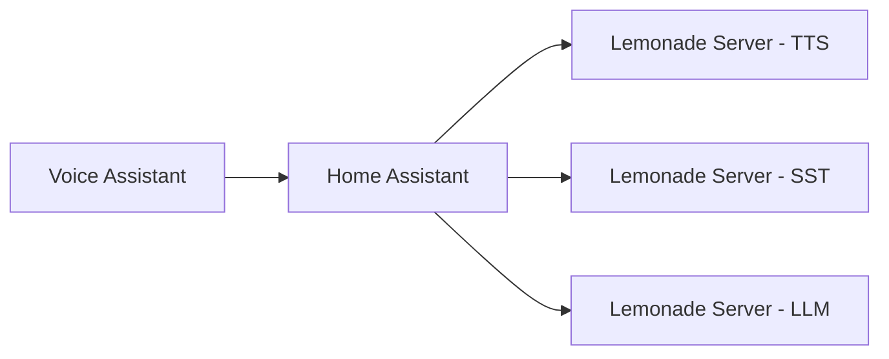

# Introduction

Welcome to the Lemonade Home Assistant Guide. This guide will help you set up a complete local voice assistant system using Lemonade Server integrated with Home Assistant.

## What is Lemonade Server?

Lemonade Server is a local AI server that brings together speech-to-text (STT), text-to-speech (TTS), and large language model (LLM) capabilities—all within a single easy to use application that can run on hardware you own. Unlike cloud-based voice assistants, Lemonade Server processes everything locally, ensuring your voice data never leaves your machine.

**Key capabilities:**

- **Speech-to-Text**: Convert spoken audio to text using Whisper models
- **Text-to-Speech**: Generate natural-sounding speech using Kokoro
- **Language Model**: Power conversations with local LLMs like Qwen or GPT-OSS
- **AMD NPU Acceleration**: Leverage Ryzen AI for faster inference

{: .note }
> This guide focuses on Ubuntu 24.04. Many of the steps however are directly transferable to Windows.

## Why Local Voice Assistant?

Setting up a local voice assistant offers several compelling benefits:

- **Privacy**: Your voice data never leaves your local network. All processing happens on your hardware, with no data sent to cloud services.
- **Control**: You choose your AI models and customize their behavior. Switch between different models, adjust parameters, and tune responses to your needs.
- **No Subscription**: Run entirely offline after the initial model download. No monthly fees, no API limits, no service interruptions.
- **Works Offline**: We live in interesting times. As a result, services are interupted by natural or manmade disaster, service discontinuations, and many other unpredictable calamities. Running this locally on your own hardware lets you sail by without interuption, without having to purchase a new and likely more expensive version of something you already have.

## Architecture Overview

Home Assistant and Lemonade Server will interact through Home Assistant Custom Components and Lemonade Servers OpenAI Comptable API's.



```text
┌─────────────────────────────────────────────────────────────────┐
│                    HOME ASSISTANT                               │
│             (Voice Pipeline, Automations)                       │
└────────────────────────────┬────────────────────────────────────┘
                             │ 
                             ▼
┌─────────────────────────────────────────────────────────────────┐
│                    LEMONADE SERVER                              │
│            (Local AI Server - STT, TTS, LLM)                    │
│                                                                 │
│  ┌──────────────┐  ┌──────────────┐  ┌──────────────┐           │
│  │   Whisper    │  │    Kokoro    │  │   LLM        │           │
│  │   (STT)      │  │    (TTS)     │  │(Qwen/GPT-OSS)│           │
│  └──────────────┘  └──────────────┘  └──────────────┘           │
│                                                                 │
│          Hardware: CPU / GPU / AMD NPU (Ryzen AI)               │
└─────────────────────────────────────────────────────────────────┘
```

**How it works:**

1. **Voice Input**: You speak to Home Assistant through a supported device (browser, satellite, etc.)
2. **Speech-to-Text**: Whisper converts your speech to text
3. **Language Model**: The LLM processes your request and generates a response
4. **Text-to-Speech**: Kokoro converts the response back to speech
5. **Voice Output**: Home Assistant plays the audio response

All of this happens locally on your hardware, with no internet connection required after initial setup.

## Hardware Requirements

Here's a quick summary of what you'll need:

| Component | Minimum | Recommended | Notes |
|-----------|---------|-------------|-------|
| CPU | 4 cores | 8+ cores | More cores = faster processing |
| RAM | 16 GB | 32 GB | Models require significant memory |
| GPU | Optional | NVIDIA RTX 3060+ | CUDA acceleration for faster inference |
| NPU | AMD Ryzen AI | AMD Ryzen AI | NPU acceleration (AMD only) |
| Storage | 50 GB | 100 GB | Models are 5-20 GB each |
| Microphone | Any USB mic | Quality USB mic | Better audio = better STT accuracy |

{: .note }
> For detailed requirements including specific software versions and network setup, see the [Prerequisites](/prerequisites) page.

## Tutorial Roadmap

This guide is organized into the following sections:

1. **[Prerequisites](/prerequisites)** - Verify your hardware and software meet requirements before starting
2. **[Installation](/installation)** - Install Lemonade Server on Linux
3. **[Speech-to-Text](/speech-to-text)** - Configure Whisper for voice recognition
4. **[Text-to-Speech](/text-to-speech)** - Set up Kokoro for natural speech output
5. **[Conversational Setup](/conversational-setup)** - Configure the LLM
6. **[Usage Examples](/usage-examples)** - Test your voice assistant with practical commands
7. **[References](/references)** - External resources and documentation links

Each section builds on the previous one, so we recommend following them in order for your first setup.

## Getting Started

Ready to build your own local voice assistant? Start by checking that your system meets the [Prerequisites](/prerequisites), then proceed to [Installation](/installation).

{: .note }
> **Estimated total setup time**: 2-4 hours depending on your hardware and familiarity with Linux.
